# Mục tiêu bài thực hành

- Thiết lập môi trường MongoDB
- Thực hành viết lệnh với MongoDB

# Công cụ & môi trường sử dụng

- MongoDB Atlas
- MongoDB Compass
- mongosh (MongoDB Shell)
- Visual Studio Code

# Cách chạy

Vào đúng thư mục chứa script và chạy lệnh: `mongosh "mongodb+srv://<username>:<password>@<cluster-url>/" script.js` hoặc chạy từng câu trong MongoDB Shell

# Kết quả

## Bài 1: Thiết lập môi trường

1.1. Đăng ký tài khoản MongoDB Atlas và tạo cluster miễn phí trên dịch vụ đám mây.

Sau khi đăng ký và đăng nhập vào tài khoản

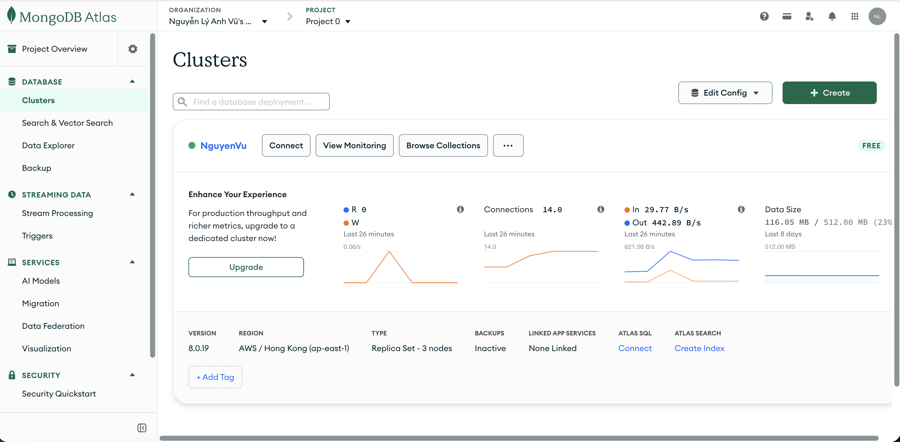

1.2. Tìm nạp dữ liệu mẫu trên MongoDB Atlas vào cluster.

Dữ liệu mẫu được nạp vào

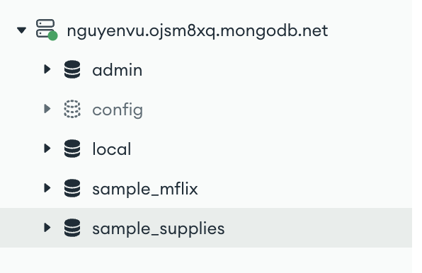

1.3. Cài đặt MongoDB Compass trên máy tính.

Giao diện MongoDB Compass

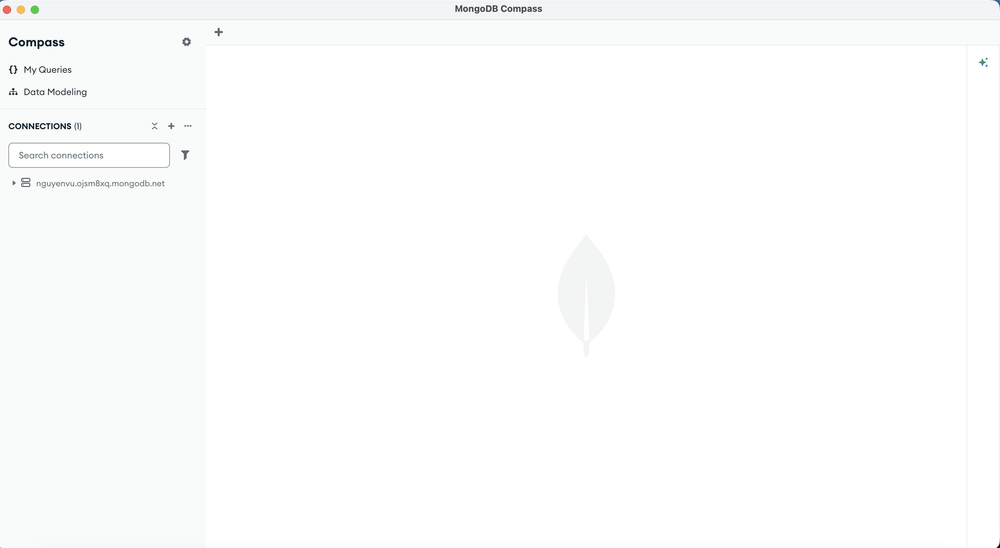

1.4. Kết nối MongoDB Compass với cluster đã tạo trên MongoDB Atlas.

Kết nối thành công MongoDB Compass với cluster

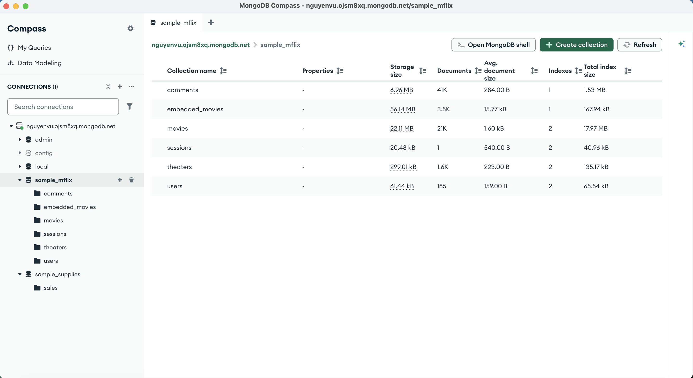

## Bài 2

Lưu ý: các bài tập dưới đây không sử dụng giao diện để thêm trực tiếp dữ liệu, hãy dùng công cụ MONGOSH có trong MongoDB Compass hoặc Mongo Shell để thực hiện việc này.

2.1. Tạo cơ sở dữ liệu có tên MSSV-IE213 trên cluster của bạn (trong đó MSSV là mã số sinh viên của bạn).

Sử dụng lệnh use để chuyển cơ sở dữ liệu 23521810-IE213

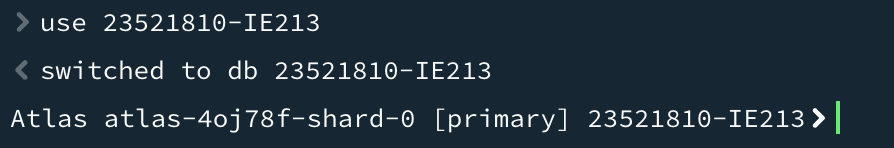

2.2. Thêm các document sau đây vào collection có tên là employees trong db vừa được tạo ở trên:
{"id":1,"name":{"first":"John","last":"Doe"},"age":48}
{"id":2,"name":{"first":"Jane","last":"Doe"},"age":16}
{"id":3,"name":{"first":"Alice","last":"A"},"age":32}
{"id":4,"name":{"first":"Bob","last":"B"},"age":64}

Sử dụng insertMany() để thêm các document vào collection (khởi tạo cơ sở dữ liệu và collection vì chưa tồn tại)

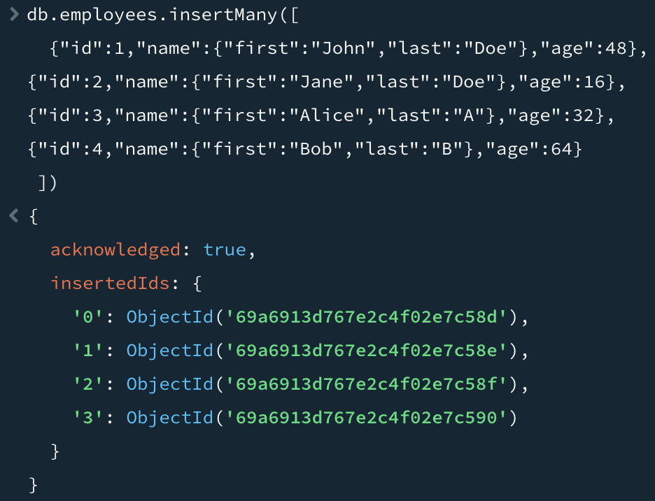

2.3. Hãy biến trường id trong các document trên trở thành duy nhất. Có nghĩa là không thể thêm một document mới với giá trị id đã tồn tại.

Sử dụng createIndex() với unique:true để đảm bảo trường id của các document không bị trùng

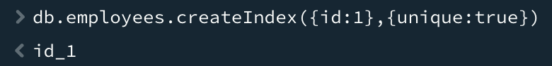

2.4. Hãy viết lệnh để tìm document có firstname là John và lastname là Doe.

Sử dụng find() với 2 điều kiện name.firstname:John và name.last:Doe

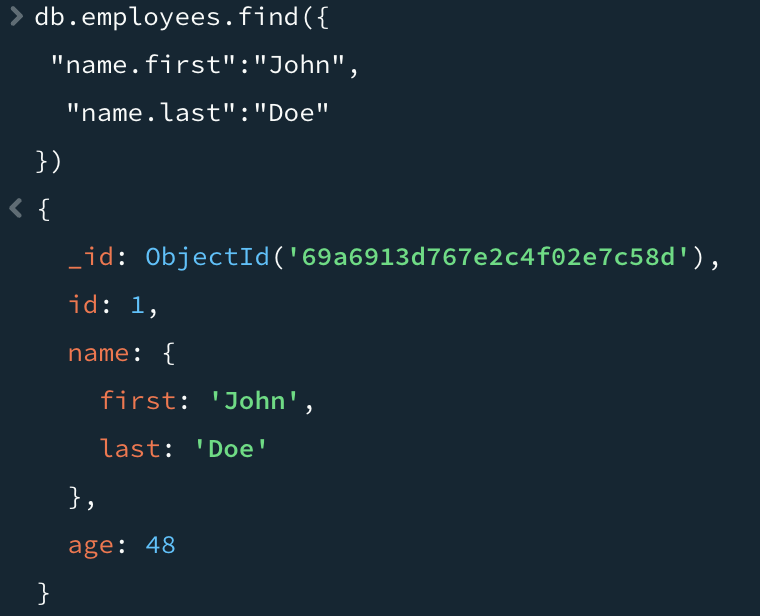

2.5. Hãy viết lệnh để tìm những người có tuổi trên 30 và dưới 60.

Sử dụng find() và các toán tử so sánh $gt, $lt để tìm người có tuổi phù hợp

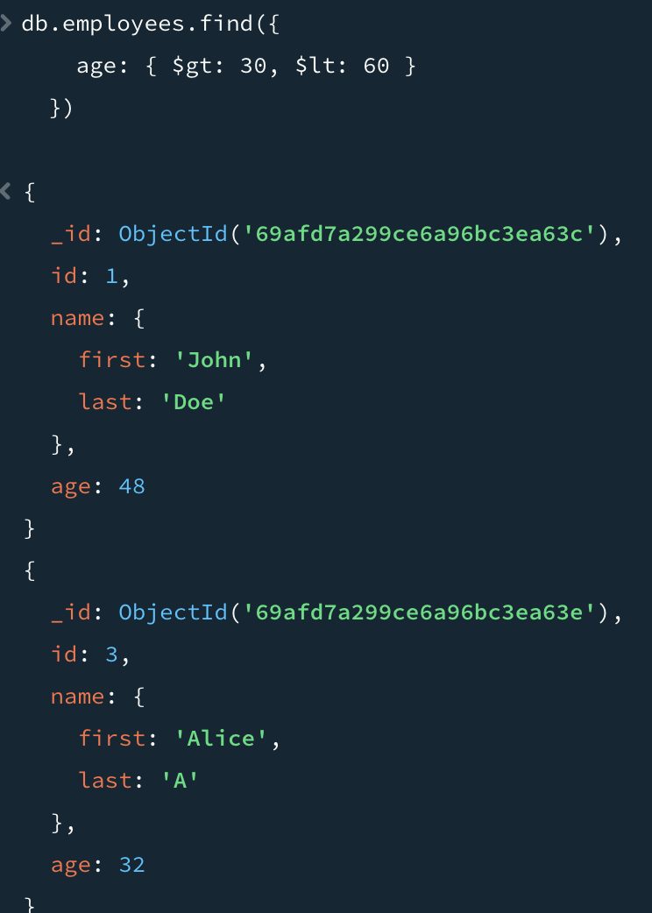

2.6. Thêm các document sau đây vào collection:

{"id":5,"name":{"first":"Rooney", "middle":"K", "last":"A"},"age":30}
{"id":6,"name":{"first":"Ronaldo", "middle":"T", "last":"B"},"age":60}

Sử dụng insertMany() để thêm các document

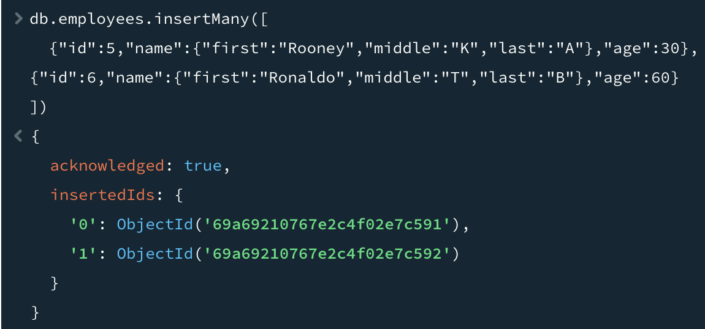

Sau đó viết lệnh để tìm tất cả các document có middle name.

Sử dụng find() với điều kiện name.middle $exists:true để tìm các document có name.middle

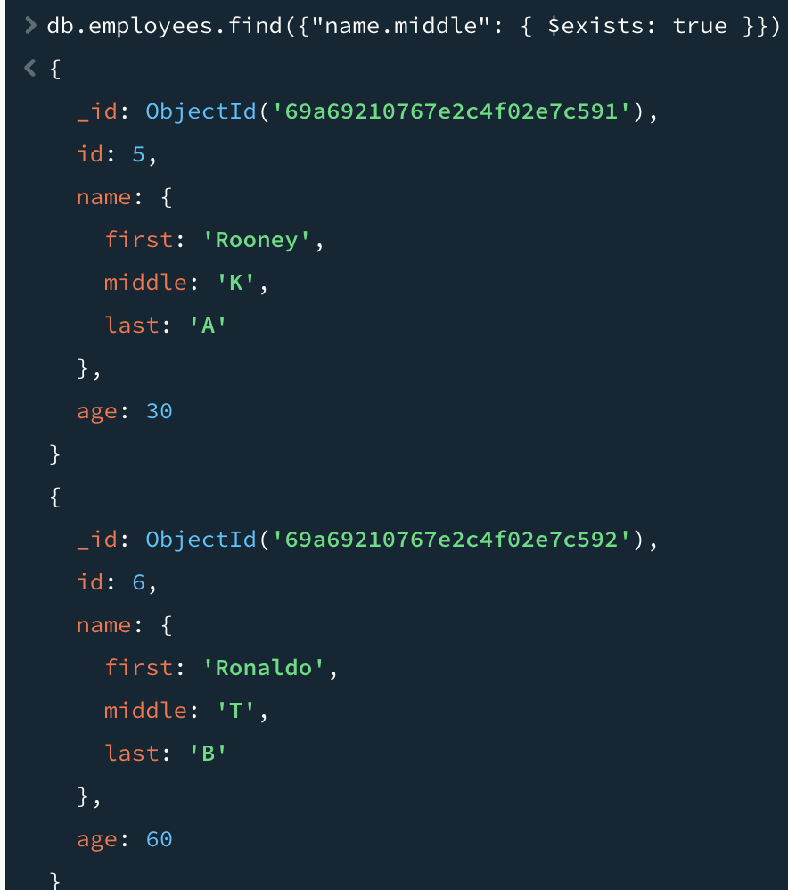

2.7. Cho rằng là những document nào đang có middle name là không đúng, hãy xoá middle name ra khỏi các document đó.

Sử dụng updateMany() với toán tử $unset để xóa trường middle khỏi các document trong

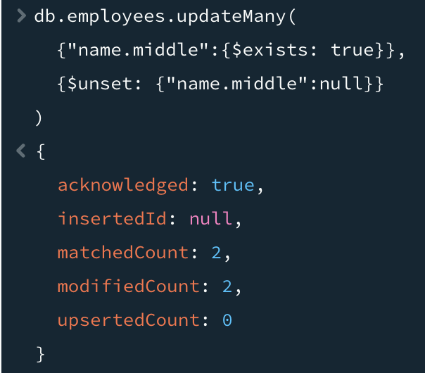

2.8. Hãy thêm trường dữ liệu organization: "UIT" vào tất cả các document trong employees collection.

Sử dụng updateMany() với toán tử $set để thêm trường organization:UIT vào tất cả các document trong employees

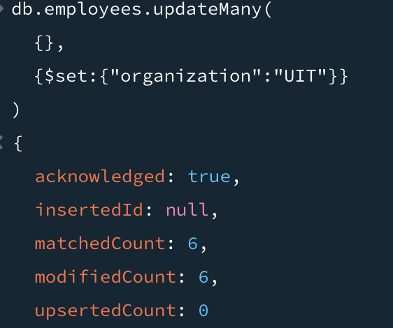

2.9. Hãy điều chỉnh organization của nhân viên có id là 5 và 6 thành "USSH".

Sử dụng updateMany() với toán tử $set và điều kiện id in [5,6] để thay đổi organization thành USSH

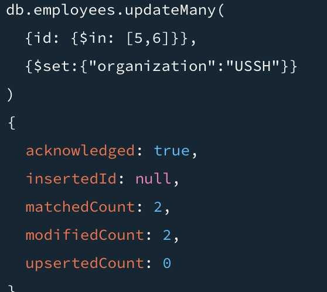

2.10. Hãy viết lệnh để tính tổng tuổi và tuổi trung bình của nhân viên thuộc 2 organization là UIT và USSH.

Sử dụng aggregate() để thực hiện phép tổng hợp dữ liệu trên collection:

- $match được dùng để lọc các document có trường organization thuộc "UIT" hoặc "USSH".
- $group được dùng để nhóm các document theo organization, sau đó tính:
  - $sum để tính tổng tuổi (totalAge) của các nhân viên trong mỗi organization.
  - $avg để tính tuổi trung bình (avgAge) của các nhân viên trong mỗi organization.
    Kết quả trả về sẽ hiển thị tổng tuổi và tuổi trung bình của nhân viên theo từng organization.

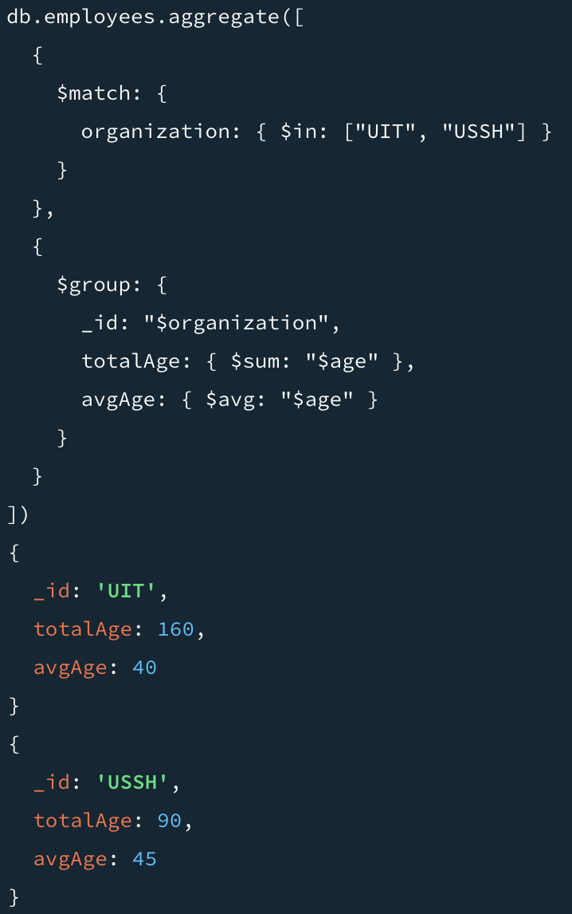

# Giải thích ngắn gọn phần chính đã thực hiện

- Tạo MongoDB Atlas, kết nối MongoDB Compass với MongoDB Atlas
- Tạo và thêm document vào cơ sở dữ liệu, tìm kiếm theo một số điều kiện, cập nhật, xóa, tổng hợp dữ liệu.

# AI hỗ trợ

- Công cụ sử dụng: ChatGPT
- Mục đích sử dụng: hướng dẫn thiết lập, các lệnh MongoDB, viết script
- Phần được AI hỗ trợ: thiết lập kết nối môi trường, chỉnh sửa script, kiểm tra các truy vấn, giải thích ý nghĩa các lệnh hoặc toán tử
