# Mục tiêu bài thực hành

- Thiết lập môi trường
- Thực hành tạo các tệp tin server.js,index.js,api/movies.route.js

# Công cụ & môi trường sử dụng

- MongoDB Atlas
- Node.js (npm)
- mongosh (MongoDB Shell)
- Visual Studio Code
- Nodemon

# Cách chạy

1. Mở Terminal và cd vào thư mục backend
2. Chạy lệnh `npm run dev`

# Kết quả

## Bài 1: Thiết lập môi trường

### 1.1. Tải và cài đặt node.js

Đã cài đặt node phiên bản 25.5.0
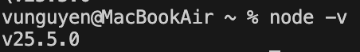

### 1.2 Tải và cài đặt một trong các công cụ soạn thảo

Đã tải và sử dụng Visual Studio Code

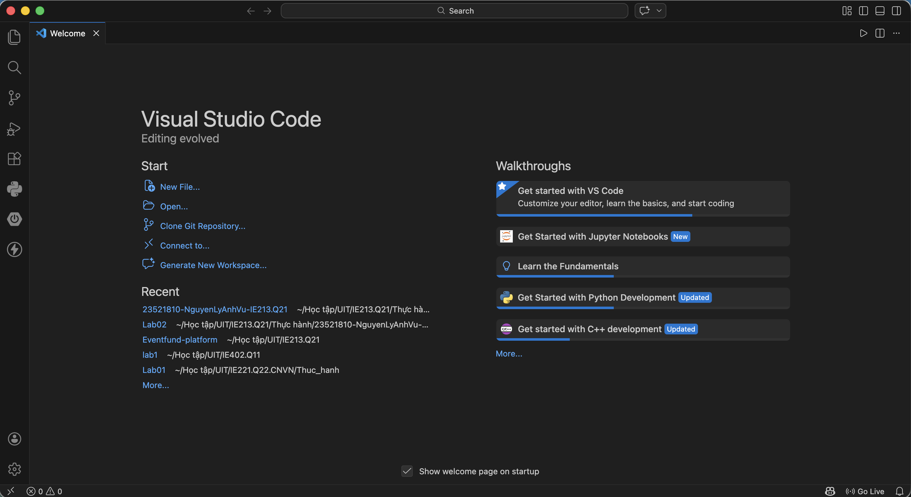

### 1.3 Khởi tạo cây thư mục chứa mã nguồn cho dự án

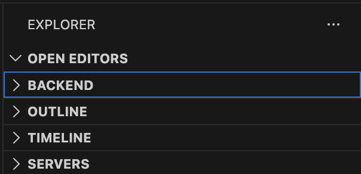

### 1.4 Khởi tạo dự án với câu lệnh `npm init`

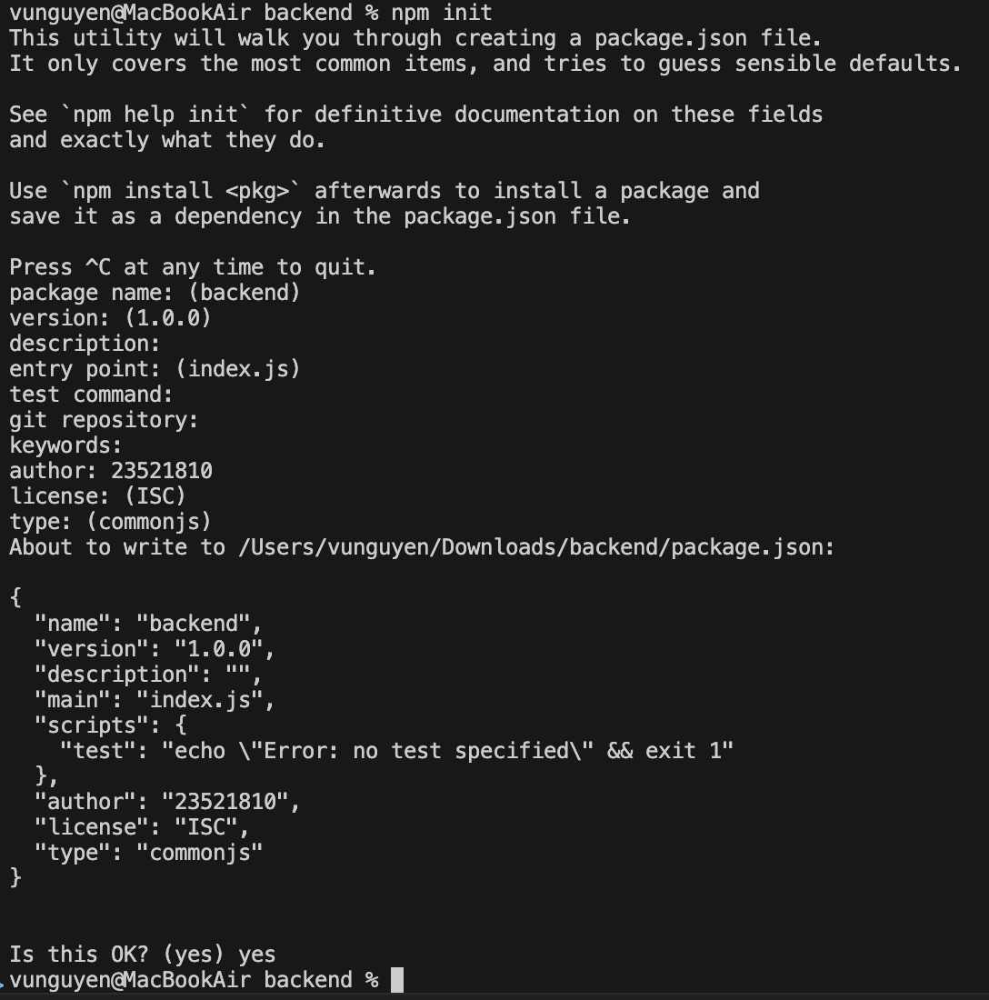

### 1.5 Cài đặt một số dependency cần thiết

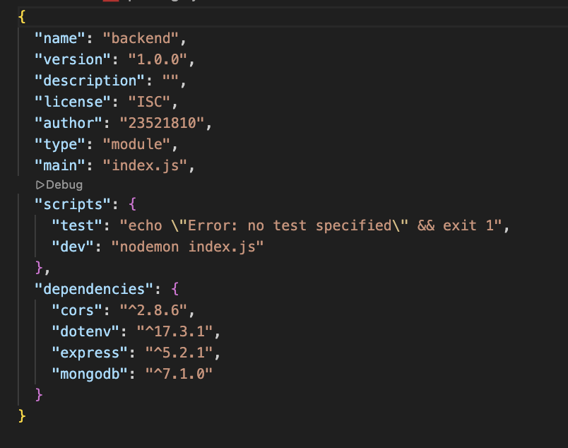

### 1.6 Cài đặt nodemon

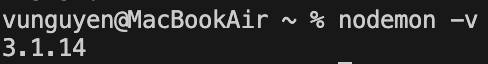

## Bài 2

### 2.1 Tạo tệp tin server.js là nơi khảo tạo máy chủ web

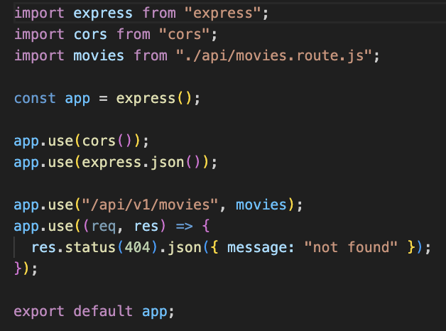

### 2.2 Tạo tệp tin .env để lưu trữ thông tin biến môi trường

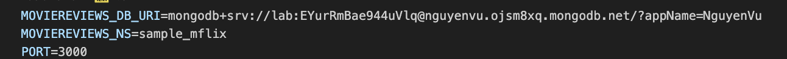

### 2.3 Tạo tệp tin index.js

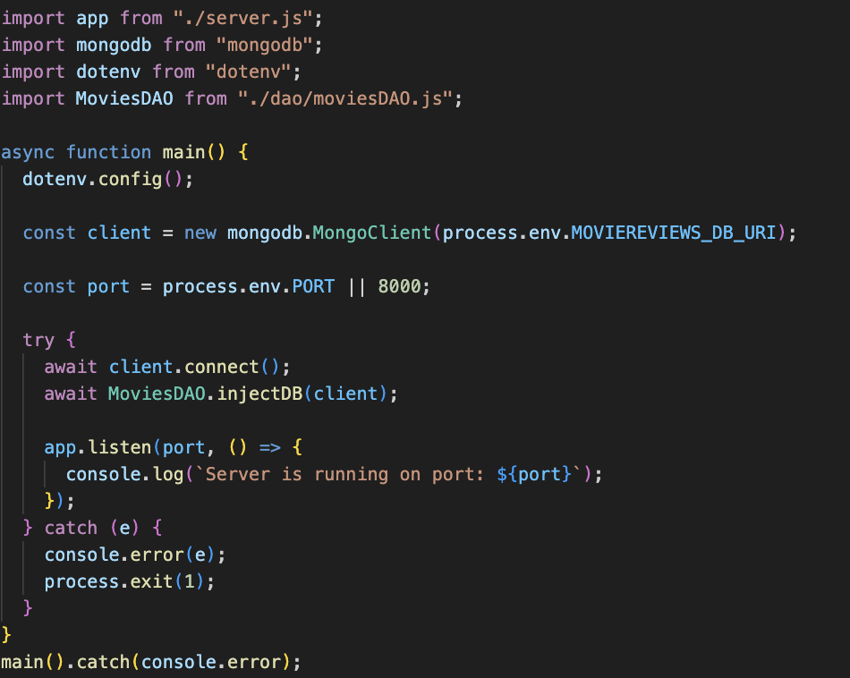

### 2.4 Tạo thư mục api và thêm tệp movies.route.js

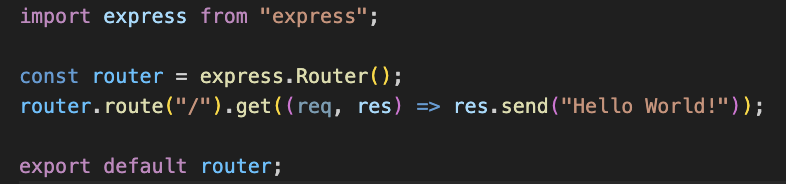

### 2.5 Tạo thư mục dao và tệp tin moviesDAO.js sau đo thêm vào index.js

Tạo moviesDAO.js

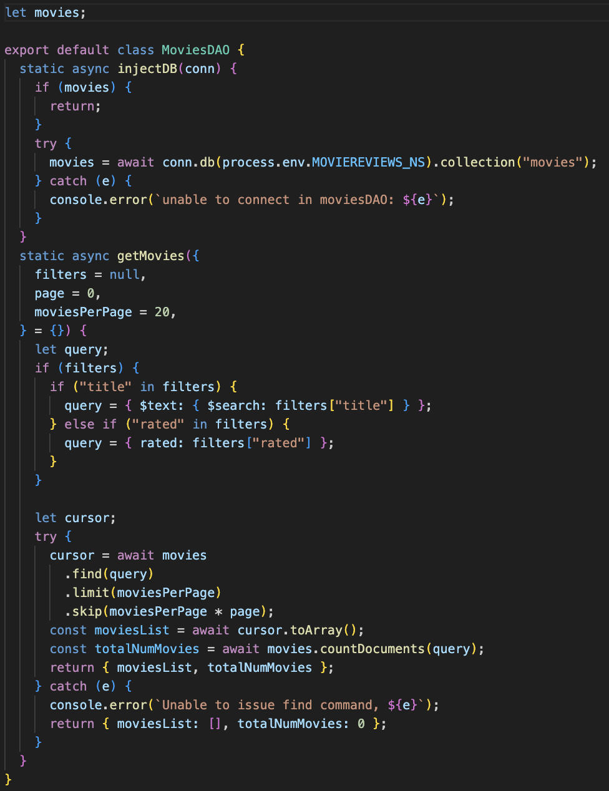

Thêm vào index.js

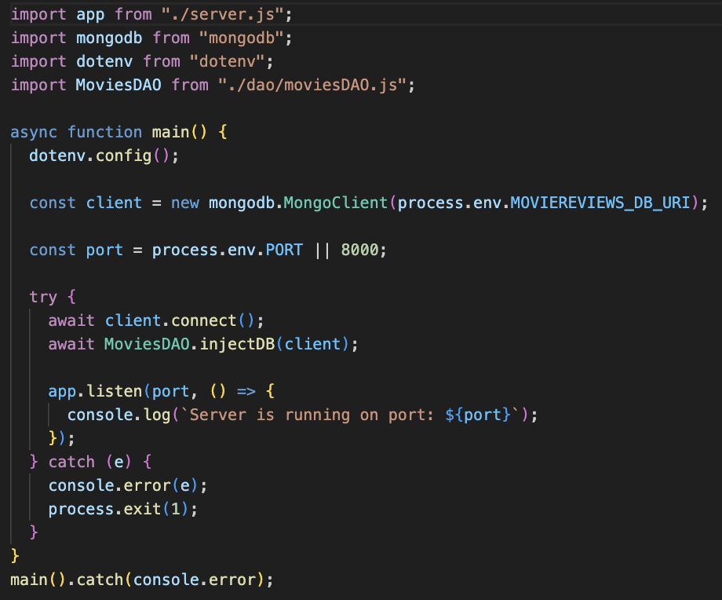

### 2.6 Thiết lập moviesController

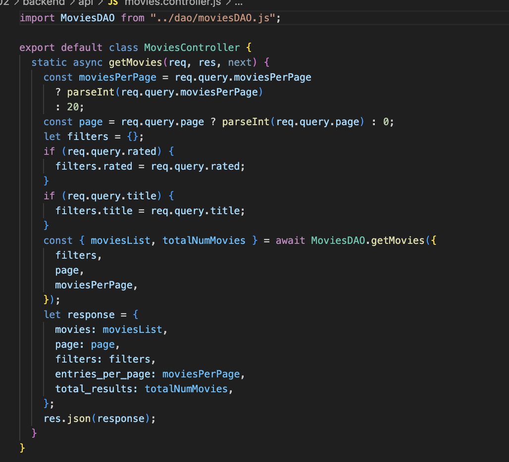

### 2.7 Thêm controller vào route và thử api

Thêm vào route

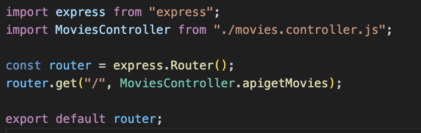
Kiểm thử api

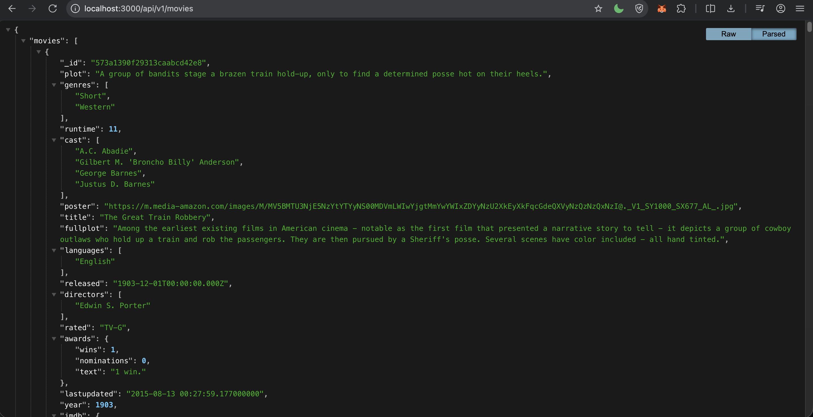

# Giải thích ngắn gọn phần chính đã thực hiện

- Cài đặt nodemon,tạo thư mục backend và cài đặt các dependency cần thiết.
- Viết server.js, index.js các file dao, api, các biến môi trườg trong .env
