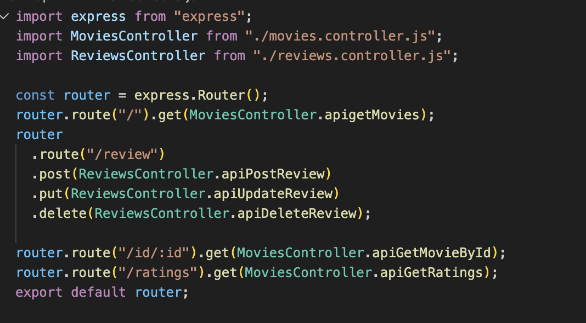

# Mục tiêu bài thực hành

- Hiểu được các kết nối giữa các phần Controller, Router, Data Access Object trong mã nguồn
- Thực hiện tạo một số tệp tin

# Công cụ & môi trường sử dụng

- MongoDB Atlas
- Node.js (npm)
- Visual Studio Code
- Nodemon
- Thunder Client (Extension)

# Cách chạy

1. Mở Terminal và cd vào thư mục backend
2. Chạy lệnh `npm run dev`
3. Dùng các công cụ kiểm thử API

# Kết quả

## Bài 1: Thiết lập định tuyến cho các thao tác với reviews trong ứng dụng minh họa

Định tuyến đường dẫn cho /review

## Bài 2 Thiết lập Controller cho reviews

### 2.1 Tạo tệp tin review.controller.js

### 2.2 Import reviewDAO.js vào tệp vừa tạo

### 2.3 Tạo phương thức apiPostReview

### 2.4 Tạo phương thức apiUpdateReview

### 2.5 Tạo phương thức apiDeleteReview

## Bài 3 Thiết lập DAO cho review

### 3.1 Import và tạo một số biến

### 3.2 Tạo phương thức InjectDB và thêm vào index.js

### 3.3 Thêm addReview

### 3.4 Thêm updateReview

### 3.5 Thêm deleteReview

\

### 3.6 Kiểm thử API đã tạo

- addReview

- updateReview

- deletereview

## Bài 4 Hoàn thành back-end cho ứng dụng minh họa

### 4.1 Thêm 2 định tuyến

### 4.2 Thêm 2 phương thức trong controller

### 4.3 Thêm 2 phương thức trong DAO

### 4.4 Thử nghiệm API vừa tạo

-getRatings

- getMoviesById

# Giải thích ngắn gọn phần chính đã thực hiện

- Thiết lập controller , DAO, router cho Review
- Thêm 2 phương thức cho Movies
