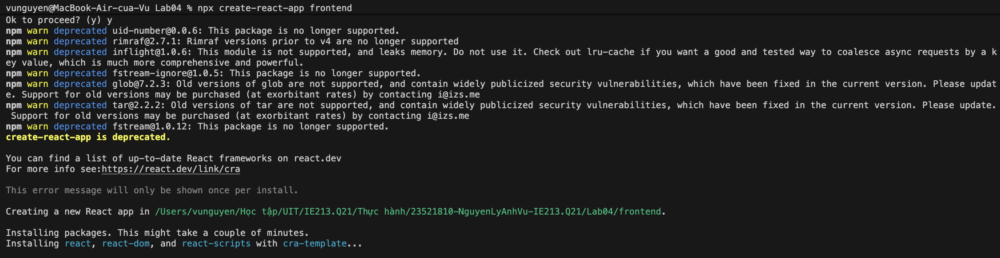
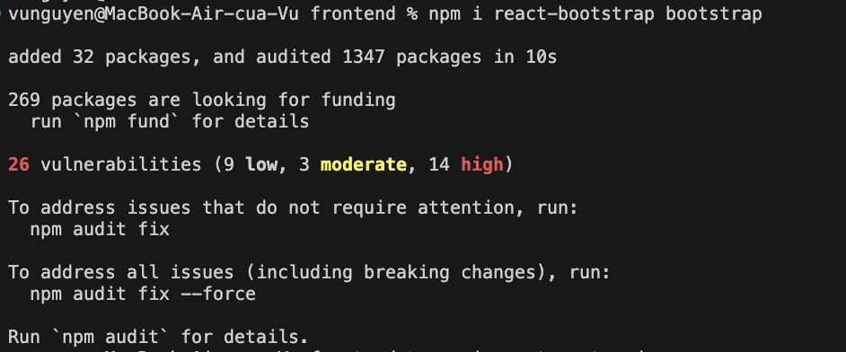
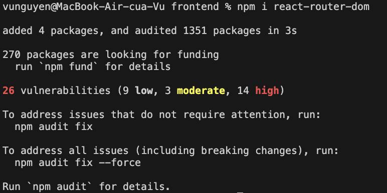
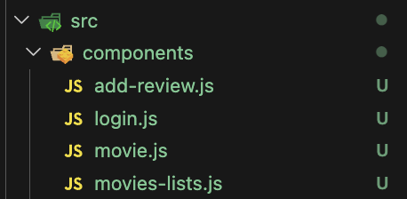
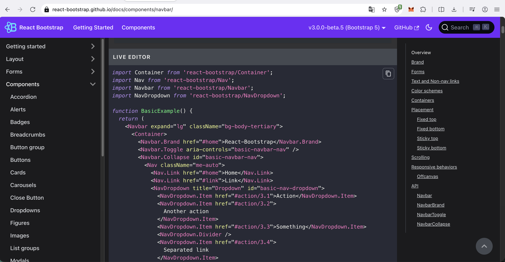
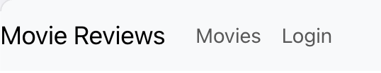
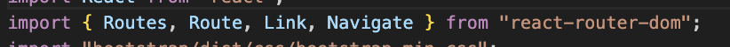
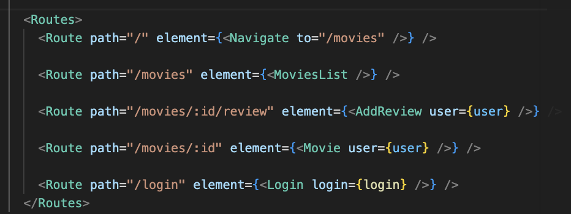

# Mục tiêu bài thực hành

- Thiết lập frontend trong MERN stack với Reactjs.
- Giới thiệu một số package chủ yếu trong việc xây dựng mã nguồn fe.
- Thực hành xây dựng thanh Navigation Header bar với sự hỗ trợ của bootstrap, cách chia các component trong dự án.

# Công cụ & môi trường sử dụng

- Node.js (npm)
- Visual Studio Code

# Cách chạy

1. Mở Terminal và cd vào thư mục frontend
2. Chạy lệnh `npm start`

# Kết quả

## Bài 1: Thiết lập nơi làm việc với frontend của dự án

### 1.1 Tạo template frontend với React

Tạo frontend với lệnh npx create-react-app frontend

### 1.2 Cài đặt package hỗ trợ

Bootstrap

React-router-dom

## Bài 2 Xây dựng Navigation Header Bar cho ứng dụng

### 2.1 Xây dựng các component cần thiết

### 2.2 Lấy Navbar component từ Bootstrap

### 2.3 Điều chỉnh một số thông tin

## Bài 3 Thiết lập định tuyến cho các component vừa tạo

### 3.1 Import Routes từ react-router-dom

### 3.2 Thiết lập định tuyến

# Giải thích ngắn gọn phần chính đã thực hiện

- Cài đặt frontend với React, cài bootstrap, react-router-dom
- Xây dụng Navigation Header Bar và định tuyến
