# Mục tiêu bài thực hành

- Kết nối FE (React) với BE và sử dụng các package cơ bản.
- Tạo form tìm kiếm và hiển thị danh sách movie bằng React-Bootstrap.
- Xây dựng trang chi tiết movie và hiển thị review.

# Công cụ & môi trường sử dụng

- Node.js (npm)
- Visual Studio Code
- Thunder client (Extension)
- MongoDB Atlas

# Cách chạy

1. Mở Terminal và lần lượt vào thư mục frontend, backend chạy `npm install` để cài các dependency
2. Chạy lệnh `npm run dev` ở thư mục movie-reviews để khởi động frontend và backend

# Kết quả

## Bài 1: Kết nối tới backend

### 1.1 Cài đặt axios cho dự án hiện tại

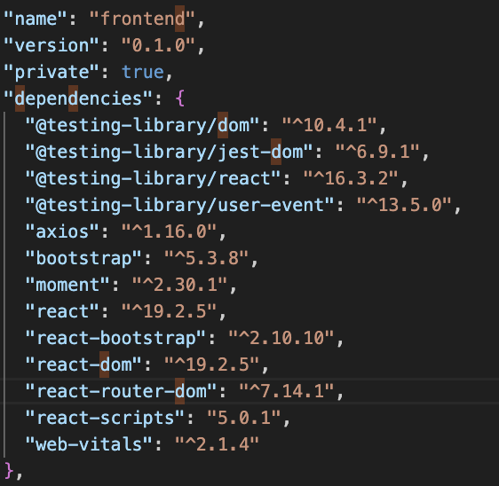

### 1.2 Tạo lớp dịch vụ có tên MovieDataService trong thư mục .src/services/movies.js

Tạo file movies.js

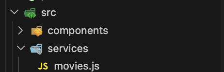

Tạo class MovieDataServices

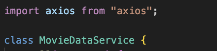

### 1.3 Tạo các lời gọi dịch vụ tới backend, sử dụng axios để gọi bao gồm:

- getAll()
- get(id)
- createReview(data)
- updateReview(data)
- deleteReview(data)
- getRatings()

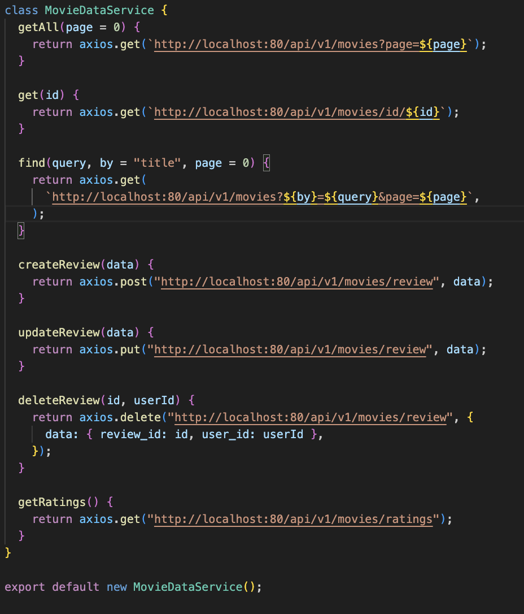

## Bài 2: Xây dựng MoviesList Component

### 2.1 Tạo các biến trạng thái: movies, searchTitle, searchRating, ratings sử dụng useState().

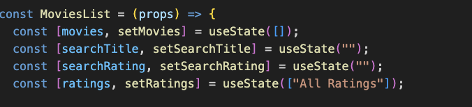

### 2.2 Tạo 2 phương thức retrieveMovies() và retrieveRatings() để lấy thông tin movie cùng danh sách các loại ratings. Dùng useEffect() để gọi chung sau khi giao diện kết xuất xong.

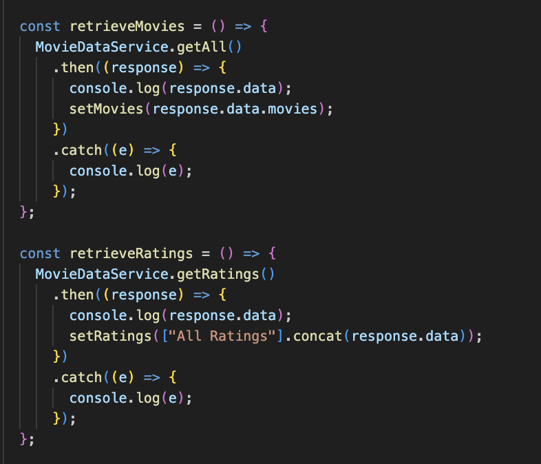

### 2.3 Tạo 2 search form gồm tìm theo title, và tìm theo rating.

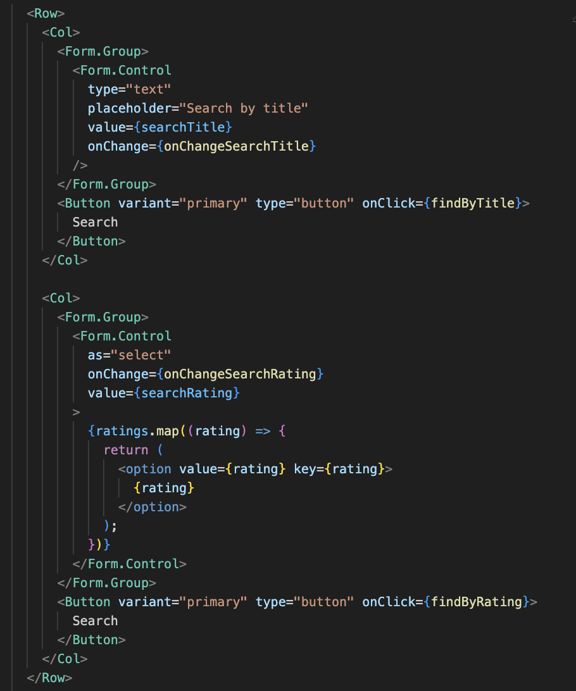

### 2.4 Hiển thị các movie bằng <Card> của React-bootstrap.

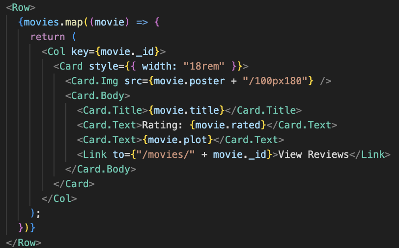

### 2.5 Hiện thực 2 phương thức findByTitle() và findByRating() để tìm phim theo Title hoặc Rating.

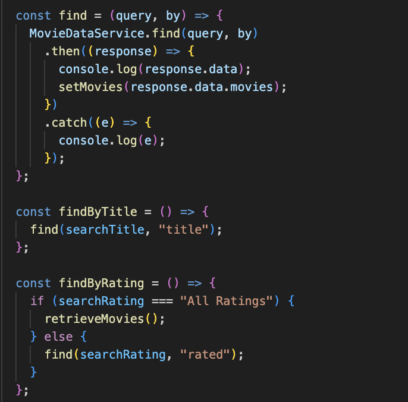

Kết quả chạy chương tình

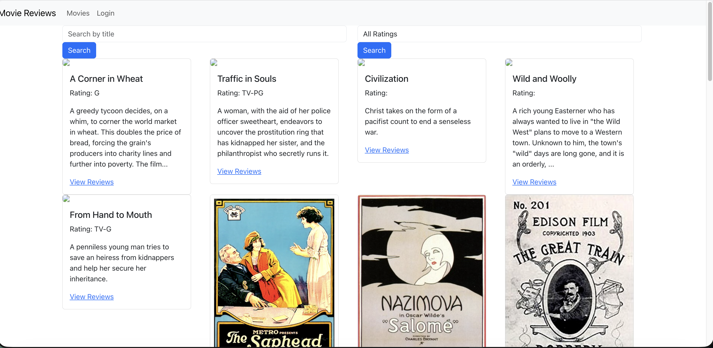

## Bài 3: Hiển thị thông tin trang movie khi nhấn vào ‘View Reviews’

### 3.1 Thiết lập mã nguồn cho component Movie trong tệp tin ./components/movie.js gồm:

- Biến trạng thái movie để lưu trữ thông tin chi tiết của movie như id, title, rated, reviews.

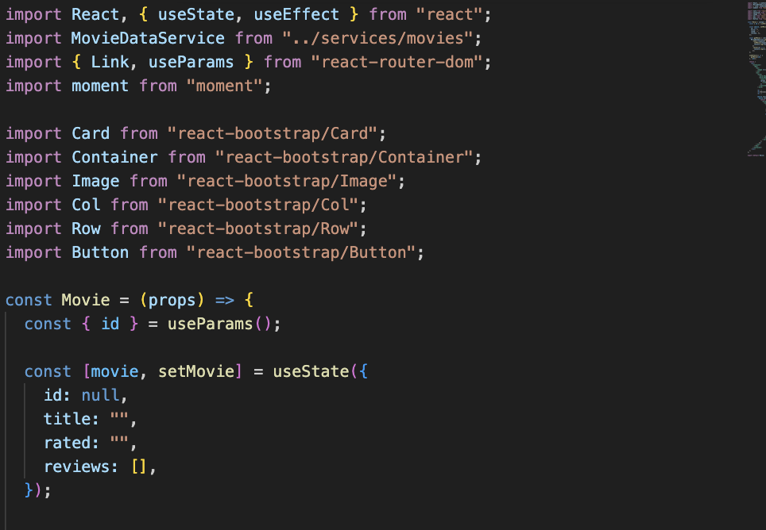

### 3.2 Xây dựng mã nguồn cho phương thức getMovie() trong component này để gọi phương thức get() trong MovieDataService.

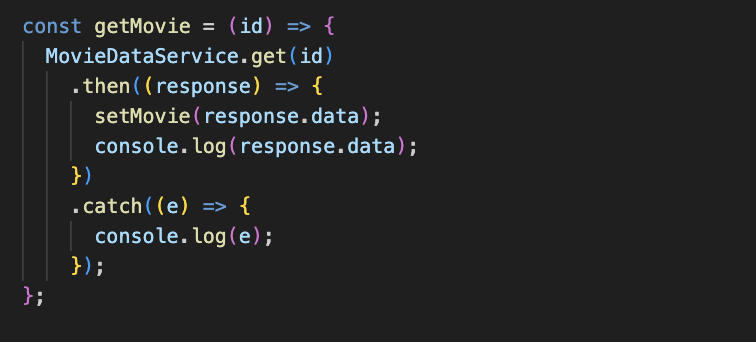

### 3.3 Trang trí cho phần JSX trả về để hiển thị như hình.

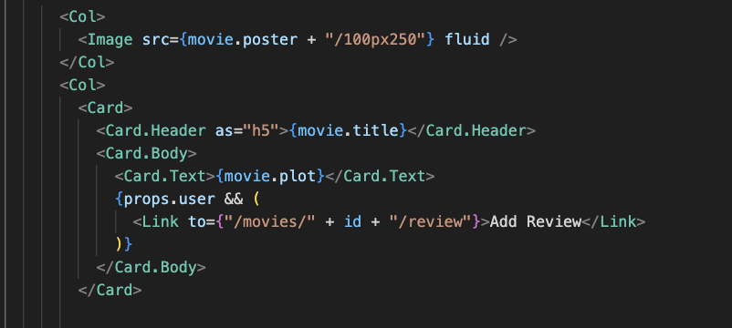

Kết quả

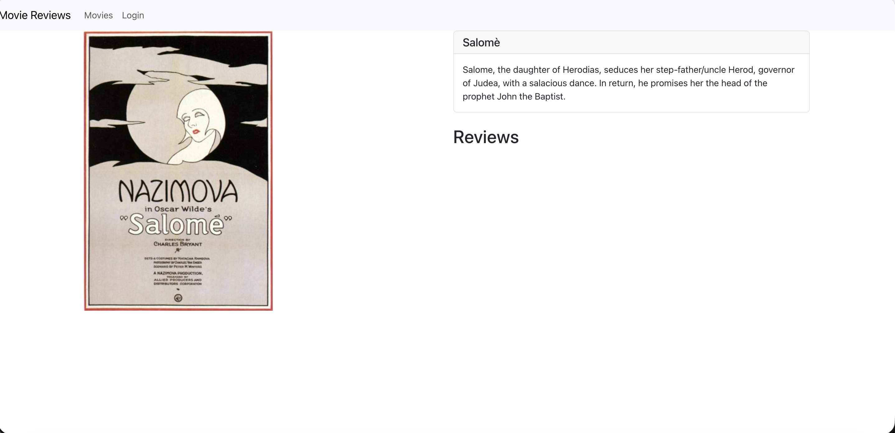

## Bài 4: Hiển thị danh sách review tương ứng cho từng phim dưới phần Plot

### 4.1 Viết đoạn mã nguồn JSX cho phép hiển thị danh sách review cho phim.

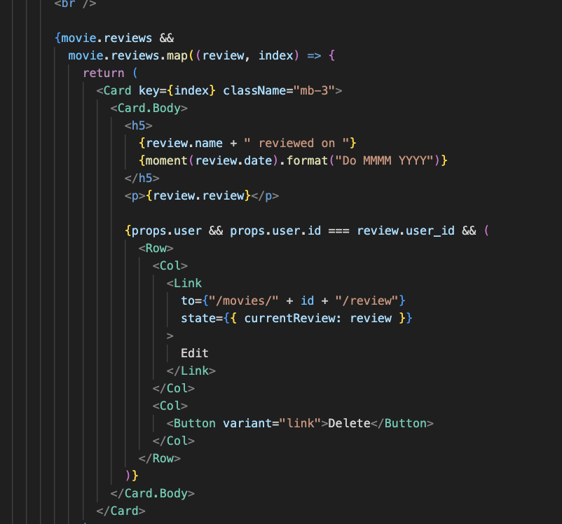

### 4.2 Xem lại slide 73 – chương 2 để hiểu cách thêm 1 review cho phim, và tiến hành thêm một số review thông qua các công cụ hỗ trợ như Postman, Insomnia.

Tạo review qua Thunder client

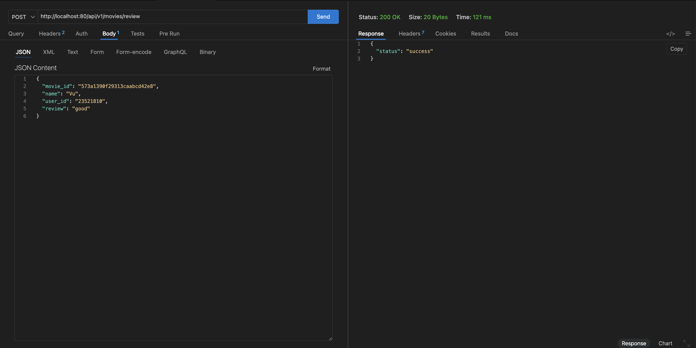

### 4.3 Điều chỉnh lại cách hiển thị giờ với momentjs.

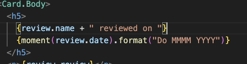

Kết quả

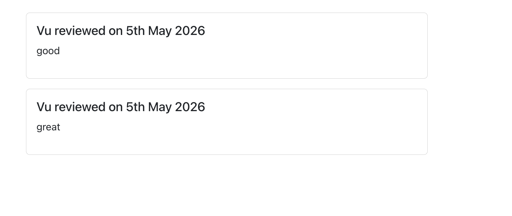

# Giải thích ngắn gọn phần chính đã thực hiện

- Xây dựng frontend bằng React, kết nối với backend thông qua axios để lấy và gửi dữ liệu movie, review.
- Tạo các component chính như MoviesList và Movie để hiển thị danh sách phim và chi tiết phim.
- Sử dụng useState và useEffect để quản lý state và gọi API khi component render.
- Tạo chức năng tìm kiếm theo title và rating, hiển thị dữ liệu bằng React-Bootstrap (Card, Form, Button...).
- Hiển thị danh sách review của từng phim và format thời gian bằng momentjs.
