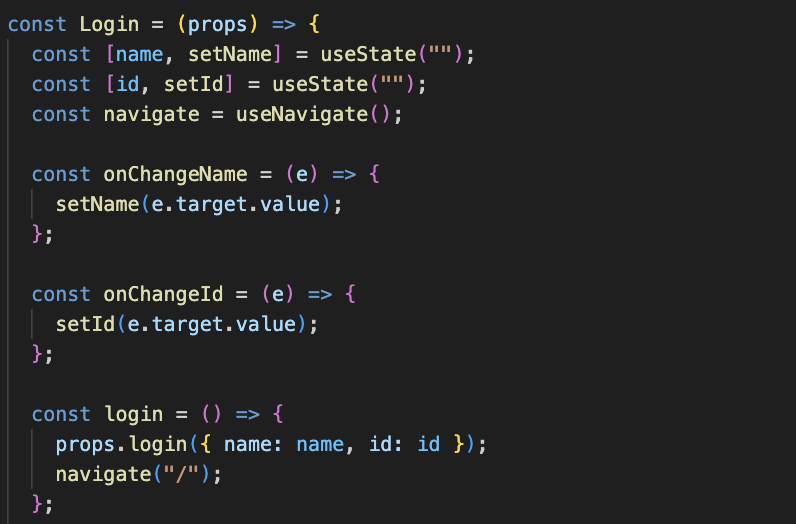
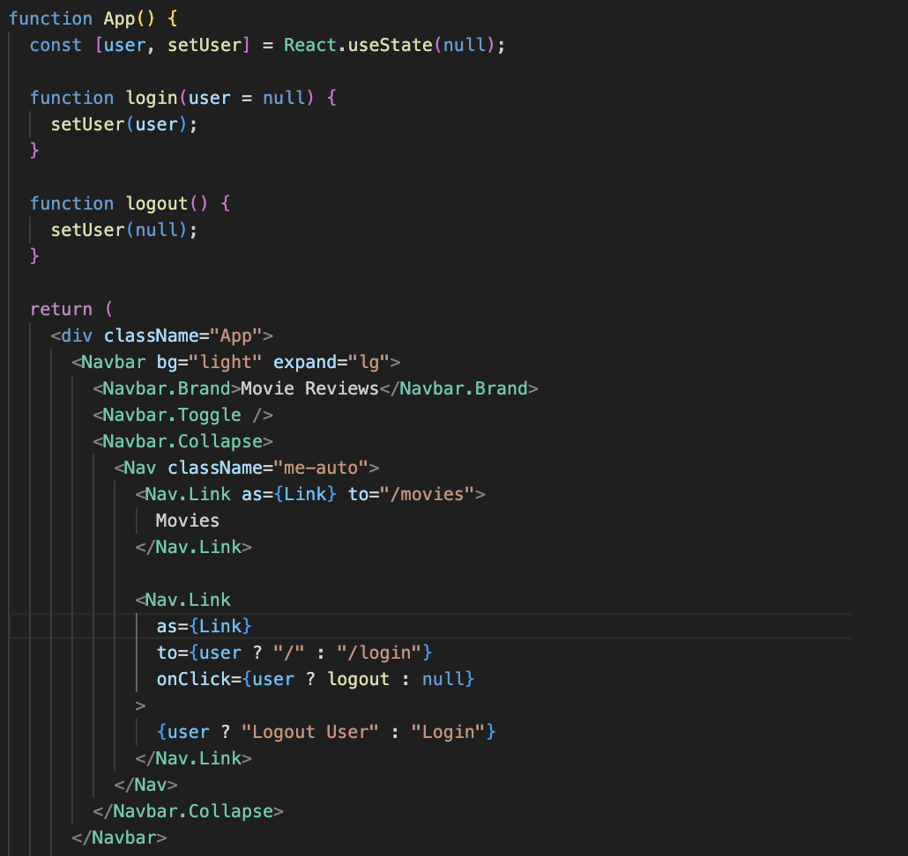
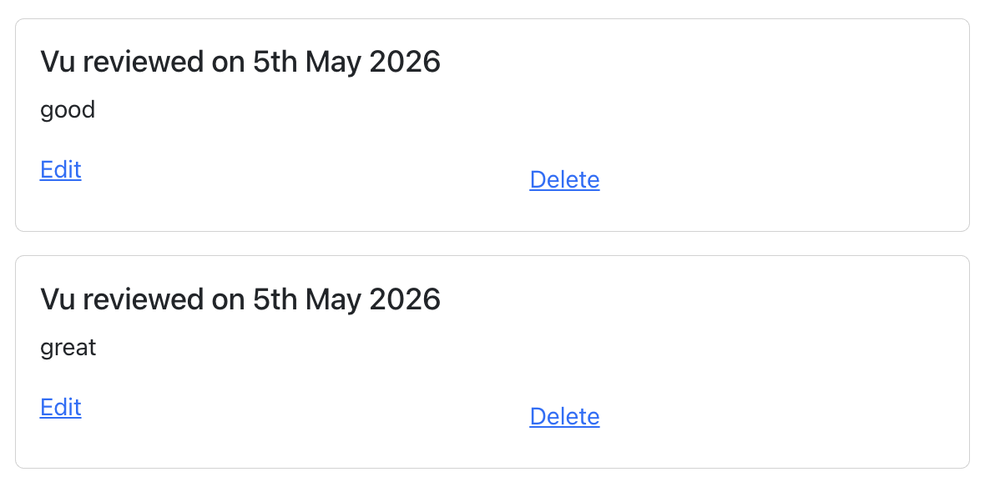
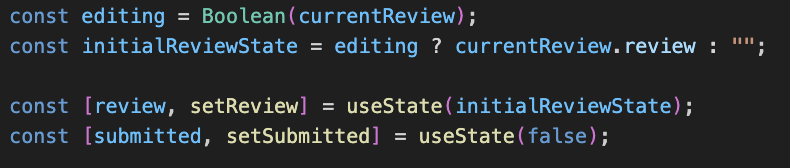
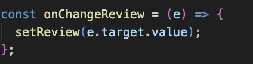
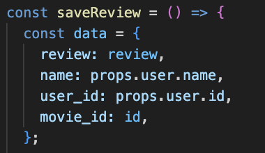
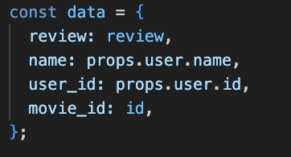
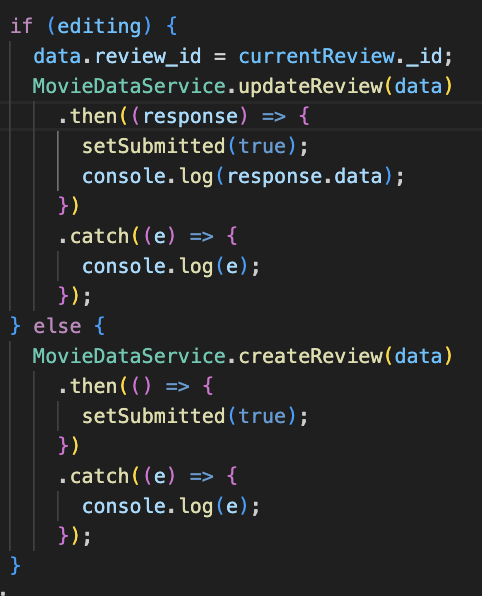
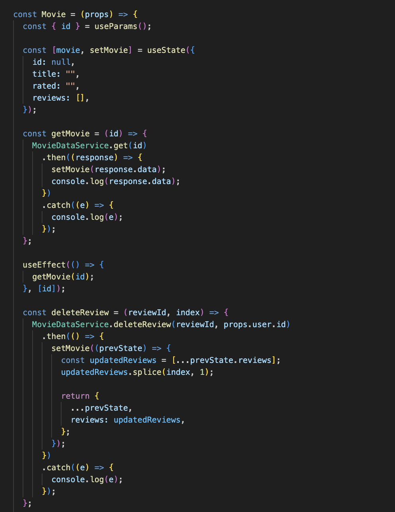

# Mục tiêu bài thực hành

- Tiếp tục xây dựng frontend với ReactJS cho ứng dụng Movie Reviews.
- Thêm chức năng đăng nhập để xác định người dùng hiện tại.
- Cho phép người dùng thêm, sửa và xoá review của chính mình.
- Bổ sung chức năng lấy dữ liệu cho trang tiếp theo khi xem danh sách movie và khi tìm kiếm.

# Công cụ & môi trường sử dụng

- Node.js (npm)
- Visual Studio Code
- ReactJS
- React-Bootstrap
- Axios
- MongoDB Atlas

# Cách chạy

1. Mở Terminal và lần lượt vào thư mục frontend, backend chạy `npm install` để cài các dependency
2. Chạy lệnh `npm run dev` ở thư mục movie-reviews để khởi động frontend và backend

# Kết quả

## Bài 1: Thêm và Sửa Review

### Câu 1.1 Tạo login component

Tạo component `Login` trong tệp tin `src/components/login.js`.

Component này thực hiện các yêu cầu:

- Tạo form đăng nhập gồm `Username` và `ID`.
- Sử dụng `useState()` để lưu giá trị `name` và `id`.
- Tạo các hàm `onChangeName()` và `onChangeId()` để cập nhật dữ liệu người dùng nhập.
- Tạo hàm `login()` để gọi hàm `login` được truyền từ `App.js`.
- Sau khi đăng nhập thành công, người dùng được chuyển về trang Home.



Trong `App.js`, thêm route xử lý trang login và truyền hàm `login` vào component `Login`.



Khi người dùng đăng nhập thành công, các chức năng `Edit` và `Delete` review của chính người dùng đó sẽ được hiển thị.



### Câu 1.2 Thêm review

Tạo component `AddReview` trong tệp tin `src/components/add-review.js`.

Các biến và trạng thái được sử dụng:

- Biến `editing` dùng để xác định component đang ở chế độ thêm mới hay chỉnh sửa.
- Biến `initialReviewState` dùng để thiết lập nội dung review ban đầu.
- State `review` dùng để lưu nội dung review.
- State `submitted` dùng để theo dõi review đã được gửi thành công hay chưa.



Các hàm được xây dựng:

- `onChangeReview()` cập nhật nội dung review khi người dùng nhập vào form.



- `saveReview()` tạo object `data` và gọi service tương ứng để gửi dữ liệu lên backend.



Khi thêm review, object `data` gồm:

- `review`
- `name`
- `user_id`
- `movie_id`



### Câu 1.3 Sửa review

Trong component `AddReview`, kiểm tra `location.state`.

Nếu `location.state` có thuộc tính `currentReview`:

- Chuyển `editing` thành `true`.
- Gán `initialReviewState` bằng nội dung `currentReview.review`.
- Khi submit, thêm `review_id` vào object `data`.
- Gọi hàm `MovieDataService.updateReview(data)` để cập nhật review.

Nếu không có `currentReview`, component hoạt động ở chế độ thêm review mới.

Chức năng sửa review được gọi từ trang chi tiết movie thông qua link `Edit` trong từng review.



## Bài 2: Xoá review

Thêm mã nguồn vào component `Movie` trong tệp tin `src/components/movie.js` để xử lý xoá review.

Trong phần hiển thị mỗi review, thêm nút `Delete`.

Nút `Delete` chỉ hiển thị khi review thuộc về người dùng đang đăng nhập:

```js
props.user.id === review.user_id;
```

Tạo phương thức `deleteReview(reviewId, index)`.

Trong phương thức này:

- Gọi hàm `MovieDataService.deleteReview(reviewId, props.user.id)`.
- Sau khi xoá thành công, lấy mảng `reviews` hiện tại trong state.
- Dùng `splice(index, 1)` để xoá review khỏi mảng.
- Cập nhật lại state `movie` để giao diện hiển thị danh sách review mới.

Khi chạy ứng dụng, người dùng đăng nhập và chọn một movie cụ thể sẽ có thể xoá review do chính mình tạo.



## Bài 3: Lấy dữ liệu cho trang tiếp theo

### Câu 3.1getAll()

Trong component `movies-list.js`, bổ sung các state:

- `currentPage`
- `entriesPerPage`

Hàm `retrieveMovies()` được cập nhật để truyền `currentPage` vào lời gọi service:

```js
MovieDataService.getAll(currentPage);
```

Sau khi nhận dữ liệu từ backend, cập nhật:

- `movies`
- `currentPage`
- `entriesPerPage`

Thêm `useEffect()` để mỗi khi `currentPage` thay đổi thì gọi lại hàm lấy dữ liệu.

Trong phần JSX, thêm nội dung hiển thị trang hiện tại và nút lấy trang tiếp theo:

- `Showing page: {currentPage}`
- `Get next {entriesPerPage} results`

Khi người dùng nhấn nút này, `currentPage` tăng thêm 1 và danh sách movie của trang tiếp theo được tải về.

### Câu 3.2 find()

Trong `movies-list.js`, bổ sung state:

- `currentSearchMode`

State này dùng để xác định chế độ tìm kiếm hiện tại:

- `findByTitle`
- `findByRating`
- Không có chế độ tìm kiếm thì lấy toàn bộ danh sách movie.

Khi `currentSearchMode` thay đổi, `currentPage` được thiết lập lại về `0`.

Tạo phương thức `retrieveNextPage()` để gọi hàm tương ứng theo chế độ hiện tại:

- Nếu `currentSearchMode` là `findByTitle`, gọi `findByTitle()`.
- Nếu `currentSearchMode` là `findByRating`, gọi `findByRating()`.
- Nếu không có chế độ tìm kiếm, gọi `retrieveMovies()`.

Hàm `find()` được cập nhật để truyền thêm `currentPage`:

```js
MovieDataService.find(query, by, currentPage);
```

Bổ sung `setCurrentSearchMode()` vào các phương thức điều khiển:

- `retrieveMovies()`
- `findByTitle()`
- `findByRating()`

Nhờ đó, khi người dùng đang tìm kiếm theo title hoặc rating và nhấn lấy trang tiếp theo, ứng dụng vẫn tiếp tục lấy dữ liệu đúng theo điều kiện tìm kiếm hiện tại.

# Giải thích ngắn gọn phần chính đã thực hiện

- Hoàn thiện component đăng nhập và lưu thông tin user trong `App.js`.
- Hoàn thiện component thêm/sửa review bằng `AddReview`.
- Chỉ cho phép người dùng sửa và xoá review của chính mình.
- Kết nối frontend với các API thêm, sửa và xoá review thông qua `MovieDataService`.
- Bổ sung phân trang cho danh sách movie và kết quả tìm kiếm theo title/rating.
